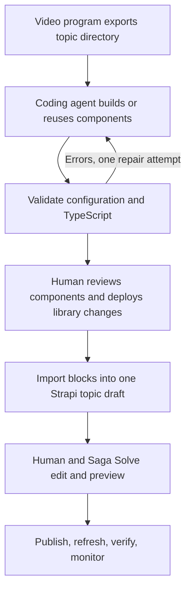

# Recorder-owned content workflow

This directory owns session export, topic jobs, agent execution and retries.
The landing checkout supplies only component contracts, rendering and validation.
Set `CONTENT_REPO_ROOT` to an absolute landing checkout path for direct Node commands.
The Rust `blog-components` command sets it from `--landing-repo`.
Set `CONTENT_WORKFLOW_RUNNER` to this directory's `scripts/content-job.mjs` when
running a recorder binary outside its original source checkout.

One topic has one stable `sourceId`, one intended destination, two video assets,
a transcript, and a list of article steps. Each step can request an interactive
explanation. The coding agent runs before the Strapi draft is assembled.



## Implemented handoff

The recorder now exposes `blog-components`. After Write Article has produced
`article.json`, prepare a job from the session (paths below are examples):

```sh
stream-recorder blog-components \
  --session /path/to/session \
  --landing-repo /path/to/saaga-landing \
  --source-id recording:stable-topic-id \
  --horizontal /path/to/full-horizontal.mp4 \
  --vertical /path/to/summary-vertical.mp4 \
  --steps /path/to/steps.json \
  --destination ai-seo-automation
```

`steps.json` is an array of `{id, brief}` objects; an example is included here.
The recorder uses the current recording version's article and chapter transcripts.
Use `--transcript /path/to/transcript.txt` to supply plain text explicitly.
Both video paths must point to distinct existing files. This stage references
media; it does not verify encoding, render or upload it.

The job lands in the session's version-specific `blog/component-job` directory.
Then launch the coding step:

```sh
stream-recorder blog-components \
  --session /path/to/session \
  --landing-repo /path/to/saaga-landing \
  --source-id recording:stable-topic-id \
  --action run
```

On resume, saved topic inputs win; export arguments do not overwrite them. Edit
`topic.json`/`transcript.txt` in the job to refine the brief. A different source ID
is rejected. Use `--action check` after a manual repair. This is a CLI stage;
there is not yet a button on the recorder's Blog tab.

The recorder-owned `scripts/content-codex.mjs` adapter uses Codex's existing login and
model configuration. It sends the task on stdin, grants workspace writes to the
job and landing checkout, and disables interactive approval prompts. Permission
failures return to the repair/review flow. Set `CONTENT_CMS_ROOT` to also allow
local CMS schema changes, `CONTENT_CODEX_BIN` for a nonstandard Codex executable,
or `CONTENT_NODE_BIN` for the recorder's Node executable. Keep these executable
paths absolute if they are not on PATH. A new component without CMS access should
include its schema patch in the job's review artifacts.

The adapter follows the installed CLI's help and the official
[non-interactive mode documentation](https://learn.chatgpt.com/docs/non-interactive-mode).
It does not bypass sandboxing. Actual model execution requires a working Codex
login; deterministic handoff tests do not call a model or publish anything.

See `examples/content-job/` for a complete text/config example. Video paths in
that fixture are placeholders; this build step does not render or upload video.

The video program creates a directory containing `topic.json`, its transcript,
and the assets (or stable asset URLs). `topic.json` requires both horizontal and
vertical references. `sourceId` identifies the topic across retries; slug and
destination describe the intended page, not separate records for each format.

```sh
node scripts/content-job.mjs prepare /absolute/path/to/topic-job
node scripts/content-job.mjs run /absolute/path/to/topic-job -- /absolute/path/to/agent-wrapper
node scripts/content-job.mjs check /absolute/path/to/topic-job
```

`agent-wrapper` is an executable adapter for your coding agent. It receives the
task on stdin and runs with the job directory as its working directory.
`CONTENT_REPO_ROOT` points to the landing checkout; `CONTENT_JOB_DIR` points to the job.
Pass additional arguments after the executable. The runner uses an argument
array, not a shell command. Agent credentials and its permission configuration
are managed by the caller; this wrapper is not a sandbox.

`prepare` writes TASK.md without launching an agent. `run` launches one build
attempt, validates its result and the repository's TypeScript, and supplies
errors to one repair attempt if needed. A per-directory lock prevents overlapping
runs. `check` reruns validation after a human repair. Use isolated checkouts for
concurrent jobs that change library code: the directory lock does not lock the
shared repository. Failed commands leave logs and a `needs_repair` status.

Outputs:

- `components.json`: one `content.embed` block per requested step, carrying the
  topic source ID. This file is input for the article assembler.
- `REVIEW.md`: agent's implementation and visual-review notes.
- `validation.json`: `building`, `checking`, `needs_repair`, or `ready_for_review`.
- `agent-N.log` / `failure-N.log`: latest bounded command output or failure.

Only `ready_for_review` passes this build stage. It does **not** mean a component
has been visually approved, deployed, imported into Strapi, or published.
Existing repository type errors also block it and must be investigated.

## Library contract

`component-catalog.json` is the machine-readable catalog: key, version, label,
description, config schema, and example. The registry is type-checked against its
keys. The renderer and CLI share runtime validation. The schema validator supports
objects, arrays, strings, numbers, integers, booleans, enum, bounds, required fields,
patterns, and the `safe-link` format; do not use unsupported JSON Schema features.

Existing `model_comparison` and `model_pareto` keep their generated data. New
`link_cards` and `step_cards` accept editorial data in Strapi's JSON `config` field.
They use native anchors and disclosures, so their text is server-rendered and
their interactions work without hydration. No arbitrary CMS code is executed.

To build a new component:

1. Read the transcript and step brief. Reuse an existing key where appropriate.
2. Add a reusable server wrapper and, if necessary, a small client child.
3. Add its versioned config schema and example to the catalog and its component
   to the registry. Keep existing keys/versions working; use a new key for a
   breaking change until multiple versions are explicitly supported.
4. Add the key to Strapi's `content.embed.componentKey` enum. Its `config` field
   remains JSON, which avoids adding nested populate requirements.
5. Write the step's configured block to `components.json`; don't hardcode the
   article's text inside the component implementation.
6. Run `node --test scripts/content-job.test.mjs` in the recorder checkout and
   `npm run content:test` in the landing checkout, then `node scripts/content-job.mjs check JOB_DIR`. Review `/component-library`
   with `npm run dev` at phone and desktop widths and with a keyboard. New custom
   interaction logic needs behavior checks beyond the generic contract tests.

The local component library shows examples and copyable configuration. It returns
404 outside development and is excluded from indexing. The first CMS editor is
Strapi's JSON field; a form-based component editor driven by catalog schemas is
the next usability layer, not implemented here.

## Deployment and publishing boundary

Deploy the library code and matching Strapi schema before content references a
new component key. Then import configured blocks into the existing topic draft,
preserving human edits. Never mark a job published merely because Strapi accepted
a create request. Import must use the stable source ID, revision checks, and the
single canonical destination, then verify publication and public rendering.

The implemented slices supply the recorder CLI launcher, Codex adapter,
configuration contract, library primitives, and local review surface. The recorder
GUI integration, idempotent Strapi importer, paired-video CMS fields/player, draft
previews, publish webhooks, and the monitoring loop remain subsequent stages.
